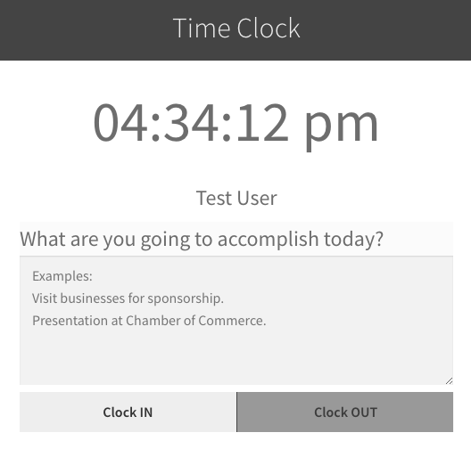
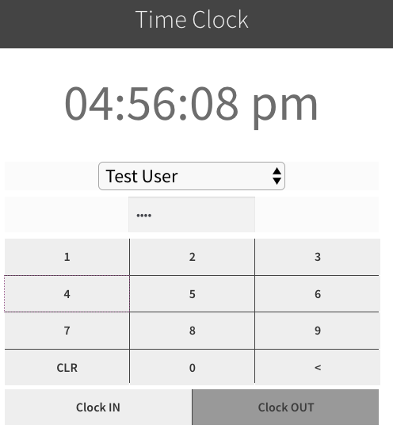

# team-time-log
Time Logging for Team activities

Track your team's time spent working or during activities, with a timeclock mode for your shop or facility, and the ability to clock in or out from their own devices when doing off-site work.

## Plugin for WordPress

This is a plugin for WordPress which adds a time logging system. It allows for:

* Authenticated users to clock in and out from any browser
* Users and admins to edit time entries
* A timeclock page for users to clock in and out without having to log in

## /time-clock

The plugin creates a page at the url of `/time-clock` which can be used while authenticated or even without authentication (however this requires the installation of a cookie).

When visiting the timeclock page as an authenticated user, the user will see buttons to clock in and clock out. It also provides a summary text area to enter information about what the team member has done during the logged time.

An unauthenticated time clock can be set up by a user with Administrative or Editor privileges by simply visiting the `/time-clock` page once while authenticated. This sets a cookie in the browser which will allow it to be used when not logged in. The purpose of this is for a stationary timeclock (e.g. by the door of the shop or facility).

Note: Unauthenticated timeclocks require entry of a User PIN, which can be set in a User's profile settings. This is to prevent team members from clocking other team members in or out.

## User access requirements

* To add timeclock entries, a user must be capable of publishing posts (the "Author" role).
* To edit others' timeclock entries, a user must be capable of editing others' posts (the "Administrator or Editor" role).
* To set the cookie for an unauthenticated timeclock, a user must be able to edit others' posts (the "Administrator or Editor" role).

## Security features

* Unauthenticated timeclocks require use of a PIN to clock in or out.
* Unauthenticated timeclocks are only allowed for browsers with a cookie installed by an admin.
* Unauthenticated timeclock cookie access can be revoked individually by simply clearing the browser cookie.
* All unauthenticated timeclock access can be revoked by disabling and reenabling the `team-time-log` plugin.

## Coming Soon

Features still to be implemented:

* Summary report of time logged for each team member.
* Tag/Category support?
* QR code support for timeclock user selection?
